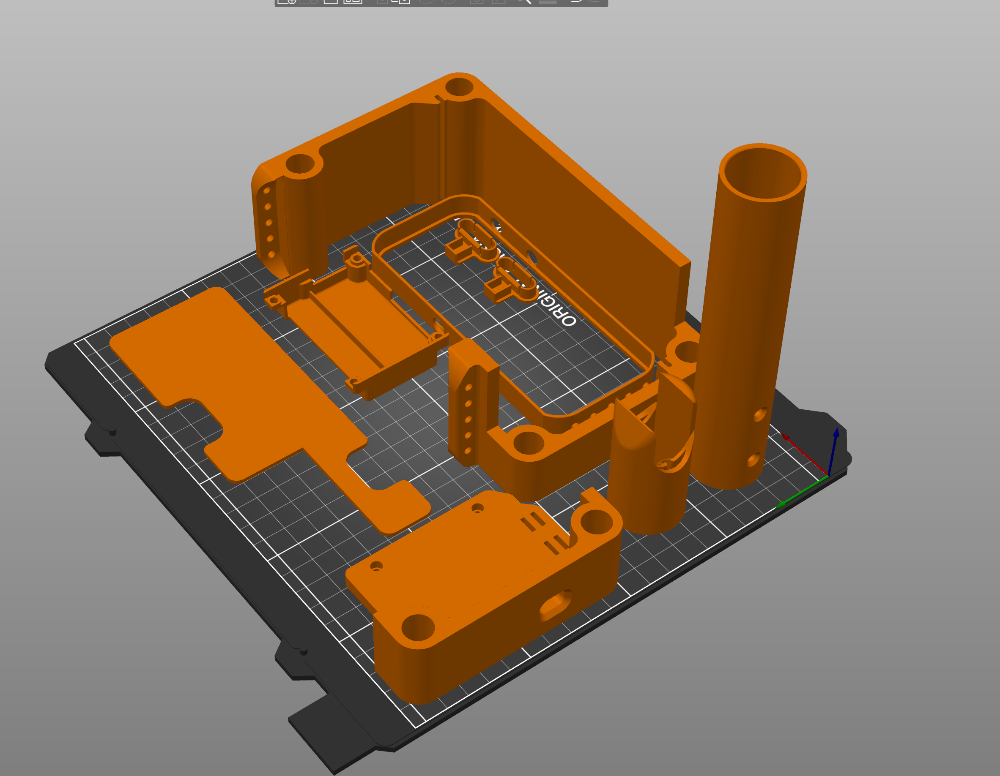

# LaserWing MiniFFB Printables
This repository contains the printable components for the LaserWing MiniFFB kits that are freely available and licensed under  **(_CC_ BY-_NC_-_ND 4.0_)**. 

**Follow us on [LaserWing.com/MiniFFB](LaserWing.com/MiniFFB)**

# Printing
* Please Print with these general orientations
* Use ASA filament or ABS filament because of their heat and chemical resistance
* Each item has the quantities needed listed in the filename if the quantity required is more than one.
* Use 100 or 99% infill. While some of these items are not high stress components , they do protect critical internal parts.
* Shaft to Grip Adapter included is compatible with VKB grips and a VKB 100m extension. 
	* You can mount Virpil and TM grips with 20x20mm extrusion adapters found on Thingiverse

# Tips

I've included a reference 3d model of a assembled unit. 

# Future Releases
Eventually I would like to release this entire project once I decide on a non-commercial license suitable for my kit parts.

Please let me know if you have need for a CAD model, I may be able to help. 

# License
[LaserWing MiniFFB ](http://laserwing.com/MiniFFB)© 2022 by Randal Barlow is licensed under [Attribution-NonCommercial-NoDerivatives 4.0 International](http://creativecommons.org/licenses/by-nc-nd/4.0/?ref=chooser-v1)

Please reach out via [email](laserwingusa@pm.com) if you have any questions regarding possible derivative works.